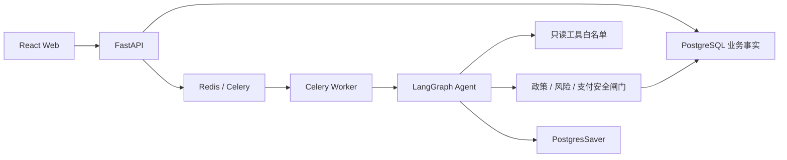

# 归舟 · 智能退换货 Agent

一个可本地运行、可审计、支持多轮补问和人工审批暂停/恢复的退款 Agent。当前实现聚焦退款
主线；换货与异常场景转人工处理。

> 这是架构与流程演示项目。订单、物流和支付为可控 Mock，不得直接接入真实资金系统。

## 它和普通工作流的区别

模型不再只做一次意图识别。Refund Agent 可以在最多 6 个步骤内自主选择只读工具，查询
订单、物流、政策和退款历史；信息不足时暂停并向用户追问。LangGraph 保存消息和执行位置，
让用户回答或人工审批后从原位置继续。

模型没有资金权限。订单归属、退款资格、金额上限、风险、审批状态和支付执行始终由确定性
代码与数据库事实控制。



## 本地启动

要求 Docker Desktop 或 Colima，以及 Docker Compose。

1. 创建本地配置：

   ```bash
   cp .env.example .env
   ```

2. 填写统一代理网关：

   ```dotenv
   LLM_BASE_URL=https://your-gateway.example/v1
   LLM_API_KEY=your-key
   LLM_MODEL=your-model
   ```

   网关需要兼容 OpenAI Chat Completions/tool calling。切换 GPT、Claude、DeepSeek 等模型时，
   通常只需修改 `LLM_MODEL`；如果网关为不同供应商使用不同入口，同时修改 `LLM_BASE_URL`。

3. 启动：

   ```bash
   docker compose up --build
   ```

   `migrate` 会先执行 Alembic、初始化 LangGraph checkpoint 表并写入演示数据；成功后 API 和
   Worker 才会启动。

打开：

- Web：[http://localhost:5173](http://localhost:5173)
- API 文档：[http://localhost:8000/docs](http://localhost:8000/docs)
- 就绪检查：[http://localhost:8000/ready](http://localhost:8000/ready)

停止服务：

```bash
docker compose down
```

清空本地数据库（会删除所有演示工单和 checkpoint）：

```bash
docker compose down -v
```

## 演示账号与订单

账号密码均为 `Demo123!`。

| 角色 | 邮箱 | 用途 |
| --- | --- | --- |
| 客户 | customer@example.com | 对话、补充信息、查看进度 |
| 审批员 | approver@example.com | 处理高风险退款 |
| 管理员 | admin@example.com | 查看审批和审计 |

| 订单号 | 金额 | 预期行为 |
| --- | ---: | --- |
| ORD-399 | ¥399 | 自动退款 |
| ORD-699 | ¥699 | 暂停等待审批，批准后恢复 |
| ORD-199-FRAUD | ¥199 | 命中风险规则，等待审批 |
| ORD-299-UNKNOWN | ¥299 | 支付结果未知，转人工且不重试 |
| ORD-500-OTHER | ¥500 | 属于其他客户，拒绝访问 |

可以先只输入“我想退款”，观察 Agent 追问订单号，再在同一工单回答。也可以直接输入：

```text
我想退货，订单号 ORD-399，原因是尺码不合适
```

## 测试

```bash
docker compose up -d postgres redis
docker compose run --rm migrate
docker compose run --rm --no-deps api sh -lc \
  "ruff check src tests migrations && mypy src && pytest -q"

cd frontend
npm run typecheck
npm run lint
npm test -- --run
npm run build
```

默认测试使用 `ScriptedModel`，不会消耗模型额度。要显式检查真实网关能否返回标准工具调用：

```bash
make smoke-model
```

## 安全边界

- 用户消息、模型输出和工具 observation 均视为不可信数据；
- 模型只能调用订单、物流、政策和退款历史四个只读工具；
- customer ID 由服务端注入，不出现在模型工具参数中；
- 控制调用不能携带金额、审批结果或支付指令；
- 支付前重新读取订单归属、金额上限、审批状态和幂等键；
- 节点重放不会重复创建消息、审批、语义审计事件或退款；
- API Key 使用 Secret 类型，不进入健康响应和审计详情。

进一步阅读：

- [Agent 运行时与本地排障](docs/agent-runtime.md)
- [Agent/LangGraph 增强设计](docs/superpowers/specs/2026-08-01-agent-langgraph-enhancement-design.md)
- [实施计划](docs/superpowers/plans/2026-08-01-agent-langgraph-enhancement-implementation.md)
