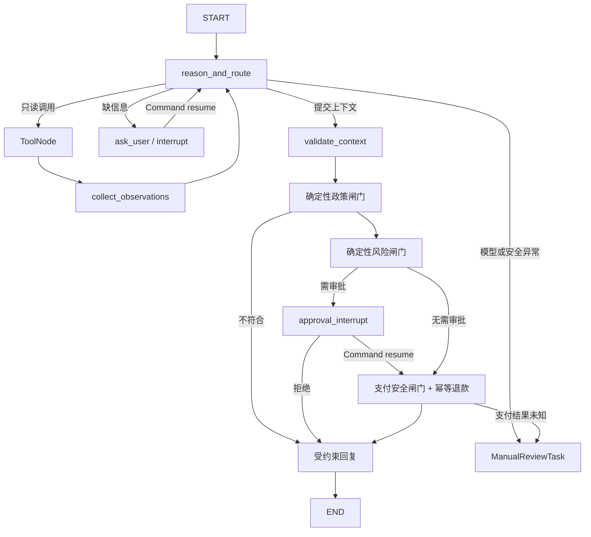

# Refund Agent 运行时

## 1. 组件职责

API 不直接运行长流程。它先把用户消息和工单写入 PostgreSQL，再向 Redis/Celery 投递
`start` 或 `resume` 任务。Worker 为每个工单获取互斥锁，然后调用 LangGraph Runtime。

PostgreSQL 同时承载两类数据，但职责不同：

- 业务表保存用户、订单、工单、审批、退款、可展示消息和审计，是业务真相；
- LangGraph 管理的 checkpoint 表保存 Agent 消息上下文和执行位置，只服务于恢复运行。

数据库升级由一次性 `migrate` 服务完成。它依次运行 Alembic、`PostgresSaver.setup()` 和幂等
seed，API/Worker 不会在启动时竞争建表。

## 2. Graph 拓扑



Agent 最多执行 `AGENT_MAX_STEPS` 轮。未知工具、混合控制调用、非法参数、过量工具调用或步骤
超限都会转人工，并写入可检索审计事件。

## 3. 模型与工具边界

运行时通过 `ChatOpenAI` 连接 OpenAI-compatible 网关。生产路径没有 Fake 模式；测试使用构造
Graph 时显式注入的 `ScriptedModel`。

模型可使用：

| 工具 | 模型提供 | 服务端可信注入 |
| --- | --- | --- |
| `get_order` | 订单号 | 当前 customer ID |
| `get_logistics` | 订单号 | 当前 customer ID |
| `search_policy` | 搜索问题 | 当前 customer ID |
| `get_refund_history` | 无 | 当前 customer ID |

两个控制 Schema 是 `RequestUserInput` 和 `SubmitRefundContext`。后者只接受订单号、退款原因和
固定的 `REFUND` 动作，额外的金额、`approved=true` 或支付参数会被拒绝。

每次逻辑模型调用写入一对 `model.requested` 与 `model.completed`（失败时为 `model.failed`）事件。
前者保存 System/Human/AI/Tool 消息和可用工具名，后者保存完整 AI 消息（含 Tool Calls）、Token
用量与耗时。两条事件通过工单、run ID、节点和逻辑轮次配对；写入前会递归脱敏常见密钥字段、
Bearer 凭证、`sk-*` 字符串和结构化 JSON 字符串中的秘密。

## 4. 两类暂停与恢复

### 用户补充信息

`ask_user` 先幂等写入问题，把工单设为 `WAITING_USER`，再调用 `interrupt()`。客户提交答案时，
API 要求携带同一 `ticket_id`，写入带 request ID 的用户消息，并投递 `resume`。Worker 使用相同
`thread_id` 调用 `Command(resume={kind: "user_input", message: ...})`。

恢复时不能只追加一条 `HumanMessage`。上一条 AI 消息包含 `RequestUserInput` 工具调用，兼容
OpenAI tool calling 的消息序列必须先追加具有相同 `tool_call_id` 的 `ToolMessage`，再追加客户
回答。否则第二轮网关会因“tool call 没有对应结果”返回 HTTP 400。内部 ToolMessage 只存在于
checkpoint，不写入客户可见的 Message 表。

### 人工审批

`approval_interrupt` 在暂停前幂等创建唯一审批任务。审批接口用乐观锁版本写入决定，再投递带
审批 ID 和数据库版本的 `resume`。恢复节点忽略 payload 中任何金额或状态，只重新读取审批表，
校验 ID、版本、状态和金额上限。批准和拒绝都会恢复 Graph；转交审批员不会恢复。

## 5. 重放与资金安全

LangGraph 在节点返回后写 checkpoint，所以 Worker 可能在业务事务已提交、checkpoint 尚未写入
时退出。副作用节点按可重放设计：

- Message 使用稳定 `dedup_key`；
- AuditEvent 使用稳定 `event_key`；
- ApprovalTask 对每个 ticket 唯一；
- RefundRequest 使用 `ticket_id:refund` 幂等键；
- 支付适配器也收到同一个幂等键；
- `UNKNOWN` 支付结果直接转人工，绝不自动重试支付。

## 6. 审批与技术异常

`ApprovalTask` 只代表业务规则要求人工决定是否退款；审批通过后 Graph 才可能进入支付节点。
`ManualReviewTask` 代表系统无法安全自动完成，类别固定为模型失败、支付未知、数据不一致或安全
校验拦截。异常任务支持认领、内部备注、解决和无法解决，但它的服务和接口不依赖审批服务，也
不具备退款执行入口。

同一个工单最多一个异常任务。迁移会把历史 `MANUAL_REVIEW` 工单补入异常队列，支付状态为
`UNKNOWN` 的归入支付未知，其余按受控审计原因分类。

## 7. 订单可见范围

- 客户：仅订单 `customer_id` 为当前用户的订单；
- 审批员：仅存在未分配或分配给自己的 `ApprovalTask` 的关联订单；
- 管理员：全部订单，并显示关联工单、审批与异常摘要。

列表与详情共用相同的数据库权限条件，猜测订单 ID 不能绕过范围限制。技术异常订单从异常详情
进入，不会因为异常任务自动出现在审批员的审批订单列表。

客户可从订单行直接发起售后。页面将可信的 order ID 和供用户确认的订单号带到聊天页；API 会
重新校验订单归属，并把工单预先关联到该订单。同一订单已有工单时拒绝重复创建，页面改为进入
已有售后。

`OrderView.lifecycle_status` 合并订单、最新工单和退款结果，列表只展示一个主状态。退款成功优先
显示 `REFUNDED`；其后依次反映技术异常、等待审批、售后处理中、退款未通过和处理失败；没有售后
覆盖时沿用订单自身状态（例如 `DELIVERED`）。异常被人工标记解决不等于退款成功。

## 8. HTTP 202 与前端轮询

消息接口在业务记录成功落库、后台任务成功进入投递路径后返回 `202 Accepted`，并用 `Location`
指向工单状态 URL。202 表示“已接受、尚未完成”，是异步 HTTP API 的标准语义，不代表退款成功。

前端在 `RUNNING` 时约 1.8 秒刷新，在 `WAITING_APPROVAL` 时约 10 秒刷新，在 `WAITING_USER` 和
终态停止。用户回答补问会恢复同一 ticket，而不是创建新工单。

## 9. 管理员测试订单工厂

测试订单工厂用于补齐本地演示的业务起点。管理员在“全部订单”选择现有客户、商品名称、自定义
金额和受控订单特征。金额决定是否命中 ¥500 自动退款上限，订单特征只控制风险与支付 Mock：

| 场景 | 服务端订单事实 | 后续退款路径 |
| --- | --- | --- |
| `AUTO_REFUND` | 正常风险、正常支付 | ≤ ¥500 自动完成；> ¥500 金额审批 |
| `RISK_APPROVAL` | 风险标记、正常支付 | 风控审批；> ¥500 时同时保留金额原因 |
| `PAYMENT_UNKNOWN` | 正常风险、支付结果未知 | 先过金额审批，再在支付阶段创建技术异常 |
| `AMOUNT_APPROVAL` | 兼容旧客户端、正常风险与支付 | 是否审批仍完全取决于输入金额 |

金额允许 ¥0.01–¥999999.99、最多两位小数，由 API Schema 和服务端政策分别校验格式与业务规则。
风险标记、支付行为和签收时间仍由服务端映射，前端不能直接覆盖。接口仅允许活动管理员调用；
客户候选也必须是数据库中的活动客户账号。

创建操作的事务边界只包含 `Order`、`DemoOrderCreation` 和 `demo_order.created` 审计事件。它不
创建 `Ticket`、`ApprovalTask`、`ManualReviewTask` 或 `RefundRequest`。客户之后在售后对话提交
消息，才会新建工单并运行 LangGraph。

`DemoOrderCreation.request_id` 是全局唯一幂等键。同一 request ID 重放时返回第一次创建的订单
和 HTTP 200；首次创建返回 HTTP 201。订单号采用 `ORD-DEMO-YYYYMMDD-XXXXXX`，生成冲突时最多
重试三次。测试订单与固定 seed 一样保存在 PostgreSQL 卷中，只有 `docker compose down -v`
会清除。

## 10. 本地排障

查看服务状态：

```bash
docker compose ps
```

查看 API/Worker 日志：

```bash
docker compose logs -f api worker migrate
```

常见问题：

- `model_config=false`：检查 `.env` 中三个 `LLM_*` 配置；
- Worker 无响应：检查 Redis、Worker 日志和是否存在同 ticket 锁；
- checkpoint 无法恢复：确认 PostgreSQL 未换卷、`thread_id` 仍为原 ticket ID；
- 模型不返回工具调用：运行 `make smoke-model` 验证网关是否支持标准 tool calling；
- 第二轮模型返回 HTTP 400：检查 checkpoint 中是否为 AI tool call、匹配的 ToolMessage、客户
  HumanMessage 的顺序；
- 修改迁移后表不一致：先运行 `docker compose run --rm migrate`，不要让 API 隐式建表。

仅在确认不需要保留任何本地数据时重置：

```bash
docker compose down -v
docker compose up --build
```
