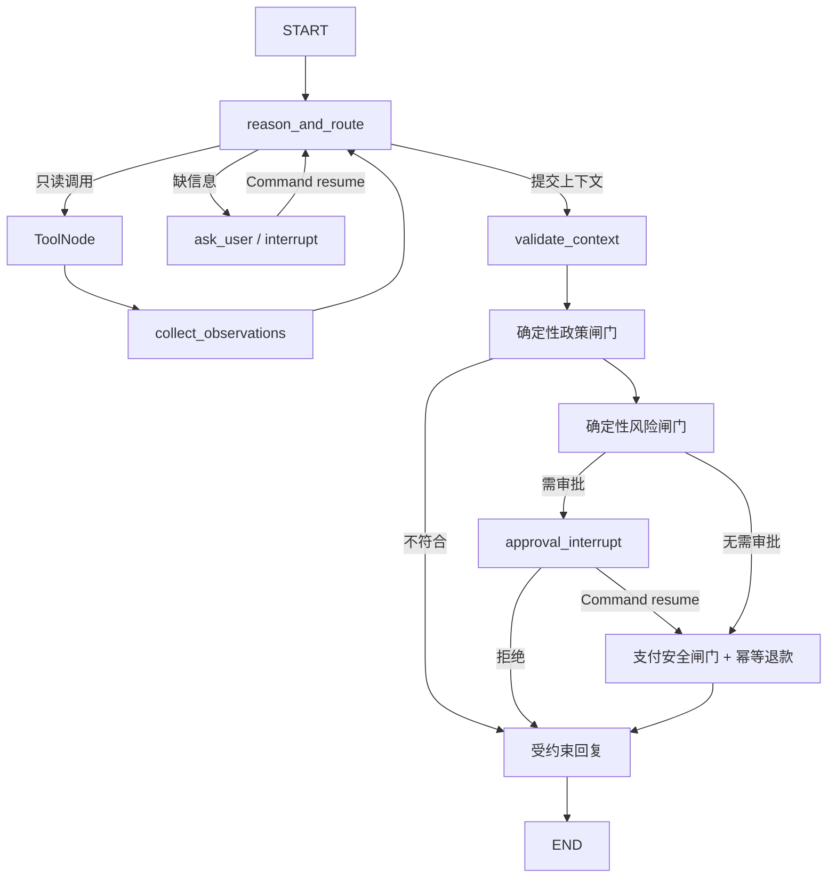

# Refund Agent 运行时

## 1. 组件职责

API 不直接运行长流程。它先把用户消息和工单写入 PostgreSQL，再向 Redis/Celery 投递
`start` 或 `resume` 任务。Worker 为每个工单获取互斥锁，然后调用 LangGraph Runtime。

PostgreSQL 同时承载两类数据，但职责不同：

- 业务表保存用户、订单、工单、审批、退款、可展示消息和审计，是业务真相；
- LangGraph 管理的 checkpoint 表保存 Agent 消息上下文和执行位置，只服务于恢复运行。

数据库升级由一次性 `migrate` 服务完成。它依次运行 Alembic、`PostgresSaver.setup()` 和幂等
seed，API/Worker 不会在启动时竞争建表。

## 2. Graph 拓扑



Agent 最多执行 `AGENT_MAX_STEPS` 轮。未知工具、混合控制调用、非法参数、过量工具调用或步骤
超限都会转人工，并写入可检索审计事件。

## 3. 模型与工具边界

运行时通过 `ChatOpenAI` 连接 OpenAI-compatible 网关。生产路径没有 Fake 模式；测试使用构造
Graph 时显式注入的 `ScriptedModel`。

模型可使用：

| 工具 | 模型提供 | 服务端可信注入 |
| --- | --- | --- |
| `get_order` | 订单号 | 当前 customer ID |
| `get_logistics` | 订单号 | 当前 customer ID |
| `search_policy` | 搜索问题 | 当前 customer ID |
| `get_refund_history` | 无 | 当前 customer ID |

两个控制 Schema 是 `RequestUserInput` 和 `SubmitRefundContext`。后者只接受订单号、退款原因和
固定的 `REFUND` 动作，额外的金额、`approved=true` 或支付参数会被拒绝。

## 4. 两类暂停与恢复

### 用户补充信息

`ask_user` 先幂等写入问题，把工单设为 `WAITING_USER`，再调用 `interrupt()`。客户提交答案时，
API 要求携带同一 `ticket_id`，写入带 request ID 的用户消息，并投递 `resume`。Worker 使用相同
`thread_id` 调用 `Command(resume={kind: "user_input", message: ...})`。

### 人工审批

`approval_interrupt` 在暂停前幂等创建唯一审批任务。审批接口用乐观锁版本写入决定，再投递带
审批 ID 和数据库版本的 `resume`。恢复节点忽略 payload 中任何金额或状态，只重新读取审批表，
校验 ID、版本、状态和金额上限。批准和拒绝都会恢复 Graph；转交审批员不会恢复。

## 5. 重放与资金安全

LangGraph 在节点返回后写 checkpoint，所以 Worker 可能在业务事务已提交、checkpoint 尚未写入
时退出。副作用节点按可重放设计：

- Message 使用稳定 `dedup_key`；
- AuditEvent 使用稳定 `event_key`；
- ApprovalTask 对每个 ticket 唯一；
- RefundRequest 使用 `ticket_id:refund` 幂等键；
- 支付适配器也收到同一个幂等键；
- `UNKNOWN` 支付结果直接转人工，绝不自动重试支付。

## 6. HTTP 202 与前端轮询

消息接口在业务记录成功落库、后台任务成功进入投递路径后返回 `202 Accepted`，并用 `Location`
指向工单状态 URL。202 表示“已接受、尚未完成”，是异步 HTTP API 的标准语义，不代表退款成功。

前端在 `RUNNING` 时约 1.8 秒刷新，在 `WAITING_APPROVAL` 时约 10 秒刷新，在 `WAITING_USER` 和
终态停止。用户回答补问会恢复同一 ticket，而不是创建新工单。

## 7. 本地排障

查看服务状态：

```bash
docker compose ps
```

查看 API/Worker 日志：

```bash
docker compose logs -f api worker migrate
```

常见问题：

- `model_config=false`：检查 `.env` 中三个 `LLM_*` 配置；
- Worker 无响应：检查 Redis、Worker 日志和是否存在同 ticket 锁；
- checkpoint 无法恢复：确认 PostgreSQL 未换卷、`thread_id` 仍为原 ticket ID；
- 模型不返回工具调用：运行 `make smoke-model` 验证网关是否支持标准 tool calling；
- 修改迁移后表不一致：先运行 `docker compose run --rm migrate`，不要让 API 隐式建表。

仅在确认不需要保留任何本地数据时重置：

```bash
docker compose down -v
docker compose up --build
```
